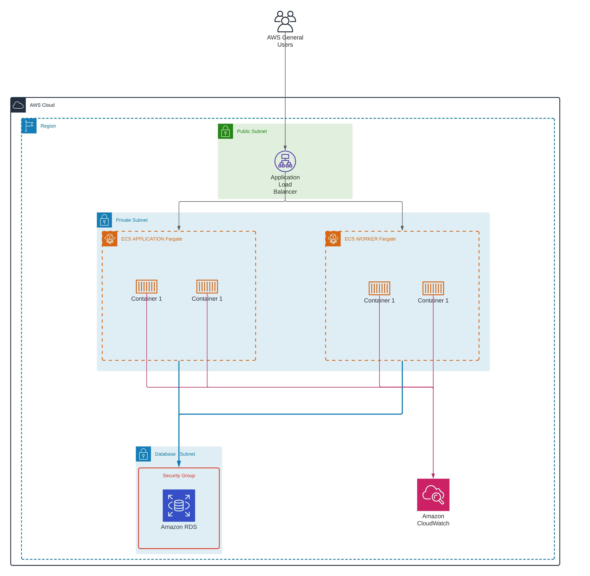

# Bump

## Prerequisites

### AWS account

[How to create aws account](https://aws.amazon.com/premiumsupport/knowledge-center/create-and-activate-aws-account/)

### IAM user with Administrative access

[How to create IAM user](https://docs.aws.amazon.com/IAM/latest/UserGuide/id_users_create.html)

### Terraform

[How to install terraform](https://learn.hashicorp.com/tutorials/terraform/install-cli?in=terraform/aws-get-started)

### S3 bucket will be used for the states

[How to create S3 bucket](https://docs.aws.amazon.com/AmazonS3/latest/userguide/create-bucket-overview.html)

Important:
versioning and encryption should be enabled

## Architecture Diagram

## Resources that will be created

1x S3 bucket

2x ECS Fargate clusters

1x RDS Mysql instance

Cloudwatch alarms

Cloudwatch logs groups

2x ECR reoisitiries

## Initial setup

### Buld docker images